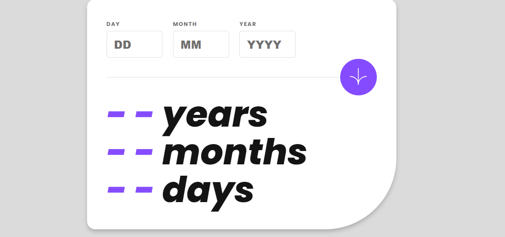
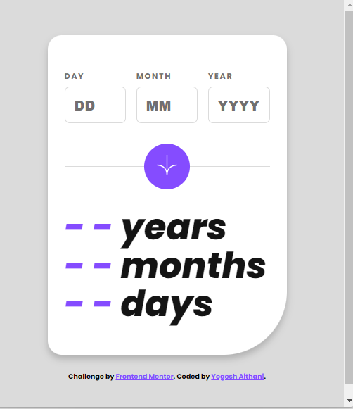

# Frontend Mentor - Age calculator app solution

This is a solution to the [Age calculator app challenge on Frontend Mentor](https://www.frontendmentor.io/challenges/age-calculator-app-dF9DFFpj-Q). Frontend Mentor challenges help you improve your coding skills by building realistic projects. 

## Table of contents

- [Overview](#overview)
  - [The challenge](#the-challenge)
  - [Screenshot](#screenshot)
  - [Links](#links)
- [My process](#my-process)
  - [Built with](#built-with)
  - [What I learned](#what-i-learned)
  - [Continued development](#continued-development)
  - [Useful resources](#useful-resources)
- [Author](#author)
- [Acknowledgments](#acknowledgments)

**Note: Delete this note and update the table of contents based on what sections you keep.**

## Overview

### The challenge

Users should be able to:

- View an age in years, months, and days after submitting a valid date through the form
- Receive validation errors if:
  - Any field is empty when the form is submitted
  - The day number is not between 1-31
  - The month number is not between 1-12
  - The year is in the future
  - The date is invalid e.g. 31/04/1991 (there are 30 days in April)
- View the optimal layout for the interface depending on their device's screen size
- See hover and focus states for all interactive elements on the page
- **Bonus**: See the age numbers animate to their final number when the form is submitted

### Screenshot

### Links

- Solution URL: 
- Live Site URL: 

## My process
The design for the form was provided by Frontend Mentor. I structured the form using semantic HTML5 markup, prioritizing accessibility. After establishing the structure, I applied CSS styling using grid and flexbox for layout purposes.

To ensure responsiveness across different screen sizes, I utilized CSS custom properties and media queries to adjust layouts and fonts accordingly.

For dynamic functionality such as real-time validation and age calculation, I implemented JavaScript. Event listeners were set up to monitor user inputs and validate them. The form elements were carefully organized to enhance user interaction. Date validations were performed using custom functions to provide immediate feedback. Additionally, input restrictions and animated age displays were implemented to improve the user experience.

### Built with

- Semantic HTML5 markup
- CSS custom properties
- Flexbox
- CSS Grid
- Mobile-first workflow
- Javascript

### What I learned

This project provided me with valuable learning opportunities across several areas. I delved deeper into form validation and live feedback using JavaScript, particularly in implementing real-time validation. Overcoming the challenge of presenting clear error messages for incorrect user inputs helped sharpen my skills in this aspect.

Furthermore, I expanded my expertise in responsive design by employing CSS grid and flexbox. This allowed me to discover new methods for creating adaptable layouts suitable for different screen sizes. Additionally, I explored the use of CSS custom properties to dynamically adjust font sizes based on screen dimensions.

In summary, this project was a hands-on experience in developing a user-focused form that effectively integrated real-time validation with responsive design principles

## Author

- Website - [Yogesh Aithani](https://aithani-yogesh.netlify.app/)
- Twitter - [@Knowledge_Hive_](https://www.twitter.com/Knowledge_Hive_)

